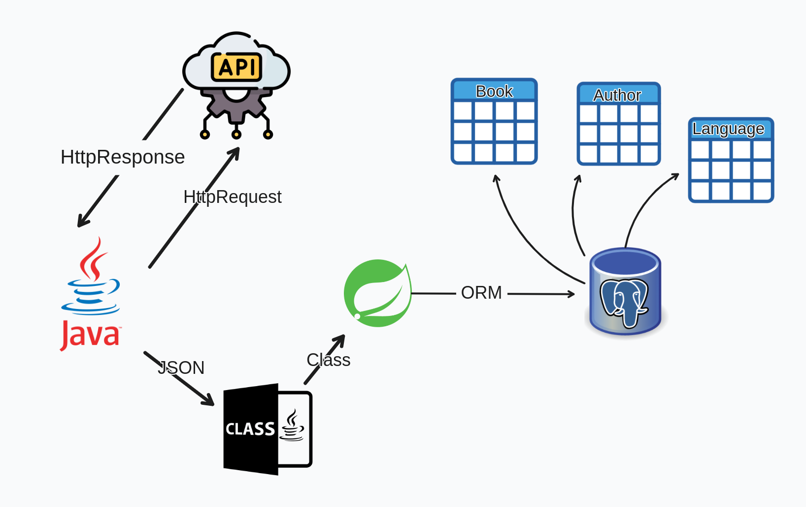
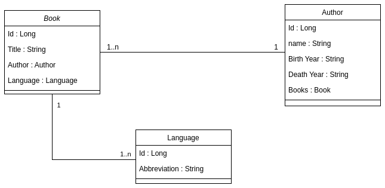

<!--<a name="literalura">
    
</a>-->

[![Contributors][contributors-shield]][contributors-url]
[![Forks][forks-shield]][forks-url]
[![Stargazers][stars-shield]][stars-url]
![personal][personal-shield]
[![Issues][issues-shield]][issues-url]
[![LinkedIn][linkedin-shield]][linkedin-url]


<!-- .png) -->


<!-- PROJECT LOGO -->
<div align="center">
   
   <h3 align="center">Challenge ONE: Literalura</h3>

  <p align="center">
    Backend application developed in Java and Spring Boot as part of a challenge to practice and solidify my study content.
    <br />
    <a href="https://github.com/luk3mn/literalura/README.md"><strong>Explore the docs »</strong></a>
    <br />
    <br />
  </p>
</div>


<!-- TABLE OF CONTENTS -->
<details>
  <summary>Table of Contents</summary>
  <ol>
    <li>
      <a href="#about-the-project">About The Project</a>
      <ul>
        <li><a href="#built-with">Built With</a></li>
      </ul>
    </li>
    <li>
      <a href="#getting-started">Getting Started</a>
      <ul>
        <li><a href="#prerequisites">Prerequisites</a></li>
        <li><a href="#installation">Installation</a></li>
      </ul>
    </li>
    <li><a href="#usage">Usage</a></li>
    <!-- <li><a href="#deploy">Deploy</a></li> -->
    <li><a href="#roadmap">Roadmap</a></li>
    <li><a href="#license">License</a></li>
    <li><a href="#authors">Authors</a></li>
    <li><a href="#feedback">Feedback</a></li>
    <li><a href="#acknowledgments">Acknowledgments</a></li>
  </ol>
</details>


<!-- ABOUT THE PROJECT -->
## About The Project

<div align="center">
    
</div>


<p align="justify">
   In this challenge, I created a comprehensive book repository by integrating data from the <a href="https://gutendex.com/">Gutendex</a> API. The process involved fetching book data in JSON format and converting this data into Java objects to ensure seamless manipulation and storage within a PostgreSQL database
</p> 
<p align="justify">
   To achieve this, I utilized Spring Boot to handle with data and streamlined backend operations. The JSON data was mapped to Java class objects using tools like Jackson, allowing for effective data manipulation and persistence. The Spring Data JPA was employed to manage database interactions, providing a clean and efficient way to handle CRUD operations.
</p>

<div align="center">
    
</div>

<p align="justify">
   To utilize the extracted data from <a href="https://gutendex.com/">Gutendex</a>, I employed the <a href="https://mvnrepository.com/artifact/com.fasterxml.jackson.core/jackson-databind">Jackson</a> library to convert the JSON response into manageable Java class objects. These objects were then structured within the Spring Boot context to build the database using ORM, ensuring seamless data handling and persistence. 
</p> 

<p align="right">(<a href="#literalura">back to top</a>)</p>

### Built With

* [![Java][Java]][Java-url]
* [![Spring][Spring]][Spring-url]
* [![PostgreSQL][PostgreSQL]][PostgreSQL-url]

<p align="right">(<a href="#literalura">back to top</a>)</p>


<!-- GETTING STARTED -->
## Getting Started

Here are some important topics about this project and how to replay it.

### Prerequisites

* [Docker](https://docs.docker.com/)
* [Docke Compose](https://docs.docker.com/compose/)

### Installation

_Before starting this application in your local environment, it'll be necessary to proceed with some tasks to reproduce this project._

1. Clone the repo
   ```shell
   git clone https://github.com/luk3mn/literalura.git
   ```
2. PostgreSQL database set up
   ```shell
   sudo docker-compose up -d
   ```


<p align="right">(<a href="#literalura">back to top</a>)</p>


<!-- USAGE EXAMPLES -->
<!-- ## Usage -->

<!-- Deploy -->
<!-- ## Deploy -->


<!-- ROADMAP -->
## Roadmap

- [x] Http Request and Http Response to extract API data
- [x] Convert data JSON in java class
- [x] Storing data from API response
- [x] find all books
- [x] find all authors
- [x] Query JPQL to get authors alive in a specific year
- [x] Query JPQL all book by language
- [x] List top 10 downloaded books


<p align="right">(<a href="#literalura">back to top</a>)</p>


<!-- LICENSE -->
## License

Distributed under the MIT License. See `LICENSE.txt` for more information.

<p align="right">(<a href="#literalura">back to top</a>)</p>


## Authors

- username: [@luk3mn](https://www.github.com/luk3mn)

## Feedback

If you have any feedback, please reach out to us at lucasnunes2030@gmail.com

> Project Link: [https://github.com/luk3mn/literalura](https://github.com/luk3mn/literalura)

<p align="right">(<a href="#literalura">back to top</a>)</p>


<!-- ACKNOWLEDGMENTS -->
## Acknowledgments
* [Gutendex](https://gutendex.com/)
* [How to parse JSON string with Jackson](https://mkyong.com/java/jackson-how-to-parse-json/)


<p align="right">(<a href="#literalura">back to top</a>)</p>


<!-- MARKDOWN LINKS & IMAGES -->
<!-- https://www.markdownguide.org/basic-syntax/#reference-style-links -->
[contributors-shield]: https://img.shields.io/github/contributors/luk3mn/literalura.svg?style=for-the-badge
[contributors-url]: https://github.com/luk3mn/literalura/graphs/contributors
[issues-shield]: https://img.shields.io/github/issues/luk3mn/literalura.svg?style=for-the-badge
[issues-url]: https://github.com/luk3mn/literalura/issues
[forks-shield]: https://img.shields.io/github/forks/luk3mn/literalura.svg?style=for-the-badge
[forks-url]: https://github.com/luk3mn/literalura/network/members
[stars-shield]: https://img.shields.io/github/stars/luk3mn/literalura.svg?style=for-the-badge
[stars-url]: https://github.com/luk3mn/literalura/stargazers
[license-shield]: https://img.shields.io/github/license/othneildrew/Best-README-Template.svg?style=for-the-badge
[license-url]: https://github.com/luk3mn/literalura/blob/master/LICENSE
[linkedin-shield]: https://img.shields.io/badge/-LinkedIn-black.svg?style=for-the-badge&logo=linkedin&colorB=555
[linkedin-url]: https://www.linkedin.com/in/lucasmaues/
[personal-shield]: https://img.shields.io/static/v1?label=ORACLE_ONE&message=ALURA&color=2e3643&style=for-the-badge&colorB=555

<!-- Stack Shields -->
[Java]: https://img.shields.io/badge/Java-E02027?style=for-the-badge&logo=java&logoColor=ffffff
[Java-url]: https://www.java.com/en/
[Spring]: https://img.shields.io/badge/SrpingBoot-6DB33F?style=for-the-badge&logo=springboot&logoColor=ffffff
[Spring-url]: https://spring.io/projects/spring-boot
[PostgreSQL]: https://img.shields.io/badge/POSTGRESQL-4169E1?style=for-the-badge&logo=postgresql&logoColor=ffffff
[PostgreSQL-url]: https://www.postgresql.org/
